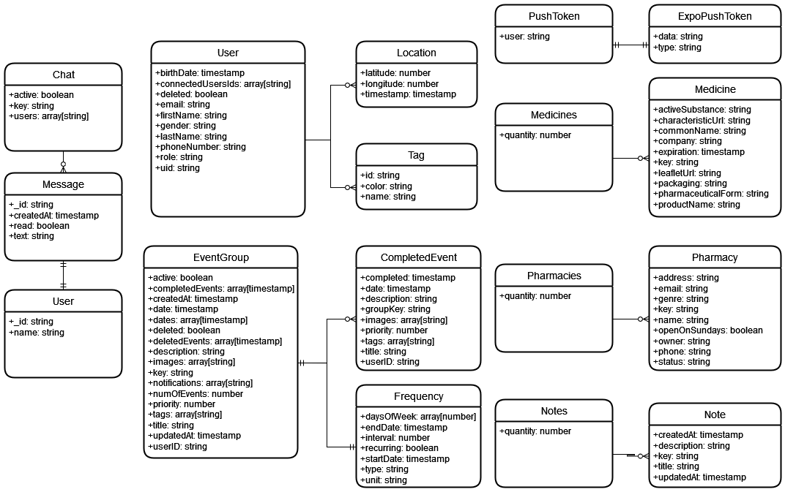

# SmartSenior

https://www.piotrpabich.com/projects/SmartSenior

SmartSenior is an efficient elderly care management mobile application built with React Native using Expo and Firebase as the backend.

## Some app screenshots

    
    
    
    
    

## Features

✅ Push Notifications  
✅ Senior / Keeper roles  
✅ Internationalization  
✅ Light / Dark Mode  
✅ Live Chat  
✅ OAuth2 / Email Auth  
✅ Calendar integration  
✅ API connection for medicines and pharmacies in Poland  
✅ Notes  
✅ Location Tracker  
✅ Recurring Events including name, description, shared images etc.

## Technologies Used

✅ React Native  
✅ Expo Modules  
✅ EAS Build  
✅ Firebase  
✅ i18n.js  
✅ Redux Toolkit  
✅ Push Notifications  
✅ Formik + Yup

**And many more :)**

## Database diagram

## Getting Started with React Native and Expo Go

### Prerequisites

- App was written in Expo 49 - compatibility with Expo 47,48,49
- Make sure you have Node.js and npm installed on your machine.

1. Clone repository
2. Install all dependencies - npm install
3. Start project - npx expo start
4. Run on virtual device or scan QR Code for Expo Go App if using physical device
